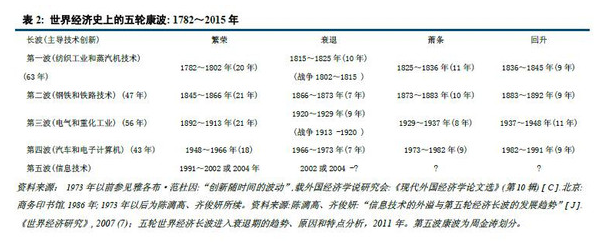

# 拥抱未来	(2016-12-17 22:26:37)

很多朋友抱怨，我的文章偏少，而且进入下半年以后，很少有上半年那样让人醒目内容的逻辑性文章。其实文章少对大家是有好处的，不断的写文章，一不小心就会引发自我强化，对自己对网友都不好。投资的时间越长，就觉得投资更像是钓鱼，亦或者狙击手。文章少而精才是王道，指哪儿打哪儿则更像是笑话。

3月份的时候，看到一位大师周金涛的文章（在我的文章里有转载），而后对他的康波周期很是着迷，之后又看了不少他之前的文章，可惜看文章容易，收集数据难。不过周金涛的文章其实是有难度的，或者说他更像是理科生，忘了大家的基础。有很多地方被他越讲越迷糊。年末，我班门弄斧一下，看看能不能深入浅出的规划一下我们的未来。

经济很糟糕，而且看不到希望，只会看到更糟糕的一面。。。记住这也是黎明前的黑暗。我们无需对未来绝望，机会无处不在。

后面3个问号，我直接提原著补上，第一个问号，周金涛认为是 2015年，后期也有文章认为2017年，其实对55年来说，边际本来就没有那么清楚，都要后人去归纳和判断的。
第二个问号，2015/2017 -----2025或2030， 究竟2025还是2030，现在判断其实太早。
第三个问号，估计现在的周金涛自己都不知道了。我们也没必要知道。
这个划分对不对，不好说。我有一些不同意见，不过我没有什么支持我的数据或者内容。这里依然尊重原著。

**商品：**
一个大的康波周期55年，最早研究康波周期的人，其实是为了研究商品的价格。简单讲就是一个商品大周期。康波周期认为在繁荣后半段，衰退的前半段是商品的牛市。而衰退后半段，到萧条和回升，繁荣前半段，都是商品周期的熊市。这个在周金涛的文章里都有数据支撑的。

哎，不对啊！现在是衰退末，萧条初，按照康波理论，大宗商品应该是熊市，你宇非子又看好铜，又看好大豆，你有没有搞错啊。。。。

在上述第四个大周期里面，就出现了这个现象。在萧条期商品并未进入熊市，而是继续牛市，最终进入了滞涨。其实原因很简单，70年代人类退出了金本位。 史前（前三个大周期) 康波周期的计价，都是在金本位下的。而第四个大周期，表面上看商品在萧条期走出了滞涨性牛市，其实如果看商品的价格与黄金价格的比值，这个比值是下降的。也就是调整为金本位以后，商品的熊市依旧。康波理论没有错，错的是我们的计算方式。你看到的70年代的商品牛市，和我说的现在即将发生的商品牛市，都是相对纸币的。这个情况下，商品对纸币的熊市，恐怕要到回升阶段，也就是2025/2030以后了，而且是让人绝望的二十年的熊市，可以参考1982-2000年。。。

**黄金：**
黄金原本是钱，但从第四个周期起，黄金也成了商品。所以第四个大周期是我们研究黄金的重点。在第四个大周期中的萧条期发生了什么？黄金从100美元左右，飙升到了850美元。而我们即将（2017），或者已经（2015）步入了萧条期，如何不引起重视？

上面讲了，按照康波周期，进入萧条期后，商品进入“熊市”。当然这个“熊市”是打引号的，是相对黄金来讲的。如果商品/黄金是熊市，反过来黄金/商品则是牛市。 如果商品对纸币是牛市，黄金对商品是牛市，黄金对纸币是疯牛。8000美元一盎司不是梦想，没准我还保守了。

所以，索罗斯说黄金是终极泡沫。

未来（2025-2030？）黄金崩盘则是世界进入“回升”的标致。世界经济将开始复苏，趋好。黄金将被抛弃20年。。。但还远比现在贵。

**股市：**

周金涛的文章里，很少用康波周期解释股市的。所以这一段是我自己的原著。

很多人抱怨，中国的股市不适合价值投资，巴菲特在中国不具备可复制性，这话有偏颇，但在今天的文章里没有错。不过我不认为是中国的股市不适合价值投资，而是这个周期里面不适合价值投资。

成就巴菲特的是什么时候？80年代至2000年。如果我们看2000年以后，至少到2011年，巴菲特连黄金都跑不赢。再回到上面那个数据表里面，没错！就是“回升”到“繁荣”，正好和商品周期错开。康波的商品和黄金的熊市，即为股市价值投资时。。。而“衰退”和“萧条”，不具备价值投资，只适合投机博傻。

还是那句话，是时代造就了巴菲特，而非巴菲特造就了时代。

中国的股市，93-05年，那只能算小孩子办家家，违法乱纪的事情堪比港剧。稍微正规一些，形成规模的时候，差不多要从2005年股改说起。也就是05年以后，中国的股市略微成熟一些。而05年以后，恰恰是“衰退”和“萧条”，股市依然是经济的反应。

2025或2030后，世界经济进入“回升”后，众所期盼的A股慢牛，将第一次粉墨登场。苦逼的80后的阳光灿烂的日子，要从这里开始。。。

周金涛的名言，人生就是一次康波。